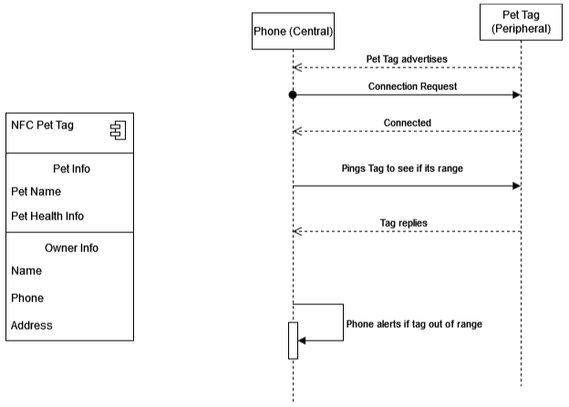

NFC + BLE Pet Tag
#####################

Overview
********

Pets are an integral part of people's lives, and it's incredibly stressful when they get lost. Our proposed project is to create a NFC Pet Tag with BLE. Our motivation behind this project was to create an easier way for pet owners to tag, keep track, and be alerted for when their pets are about to leave. Often pets can get loose and it becomes an enormous challenge to find them and get them back. We would allow pet owners to read and write a profile for their pets (containing the owner name, phone number, address, pet name) on their NFC tags, so that people can scan them if they got lost and learn pertinent information about the pet. We would also create an alert system (which we model with a blinking light) to alert the owner if the pet left a certain range based on the RSSI. Additionally, we have created a system where the owner can simply tap the tag with their mobile device to get connected to BLE.

Requirements
************

* A board with BLE and NFC support
* A mobile deivce with BLE and NFC support

Workflow
********

